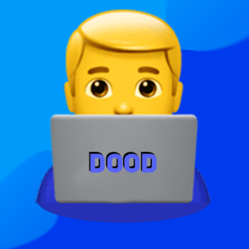

<!-- If you're reading this for whatever reason, my name is in some of my code & licenses if you look hard enough ;) -->

    
    
its-a-me, dood!
 
<!--       -->

    <h1>About me</h1>
    

        Programmer, drummer, Monster addict. 
        <i>Currently planning to go into the USMC to do cybersecurity.</i>
    

    <h3>Skills:</h3>
    <ul>
        <li>🐍 Python</li>
        <li>📜 JavaScript / TypeScript</li>
        <li>🔶 Haxe</li>
        <li>🧠 Brainf**ck (lol)</li>
        <li>🐚 Bash (a little bit)</li>
        <h3>Libraries & Frameworks</h3>
        <li>🟩 Node.JS</li>
        <li>🥟 Bun</li>
        <li>🔷 HaxeFlixel</li>
        <li>🤖 Discord.JS</li>
    </ul>
    <h3>Currently learning:</h3>
    <ul>
        <li>👴 C</li>
        <li>🦀 Rust</li>
        <li>🔥 Unreal Engine</li>
        <li>🤖 Godot Engine</li>
    </ul>

    
    

    
    

  

    
    
👨‍💻

